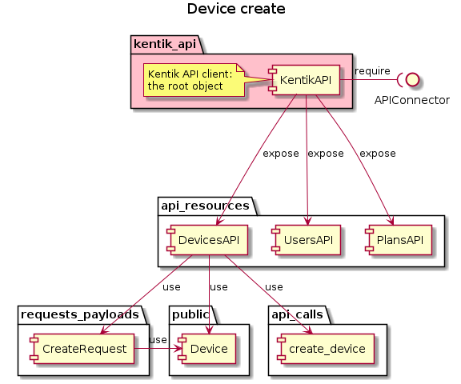
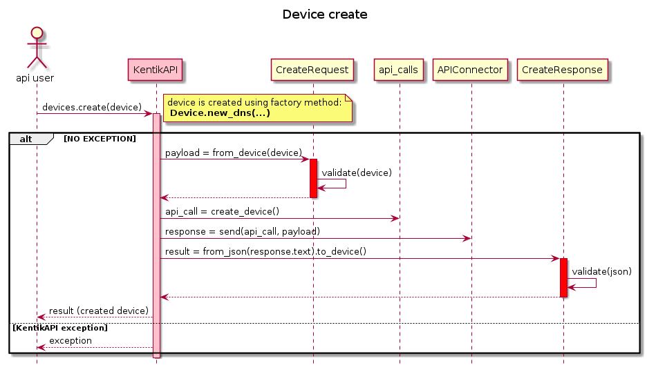

# community_sdk_python - developer

## Getting started

Recommended steps:
1. ensure you have python >= 3.6 installed
1. create dedicated virtual environment with `virtualenv .venv && source .venv/bin/activate`
1. clone the library repo with `git clone https://github.com/kentik/community_sdk_python.git`
1. `cd community_sdk_python/`
1. install requirements with `pip install -r kentik_api_library/requirements.txt`
1. run unit tests with `pytest kentik_api_library/tests/unit/ kentik_api_library/tests/integration/`
1. run mypy with `mypy kentik_api_library/kentik_api kentik_api_library/tests/ kentik_api_library/examples/`
1. run black check with `black --fast --line-length 120 --check kentik_api_library`

## Example

The example below illustrates how to create a new device using the library:

```python
# library-specific imports
from kentik_api import (
    KentikAPI,
    Device,
    DeviceSubtype,
    CDNAttribute,
    ID,
)

# initialize Kentik API client
api_client = KentikAPI("<API_EMAIL_STRING>", "<API_TOKEN_STRING>")

# prepare device object
device = Device.new_dns(
    device_name="example-device-1",
    device_subtype=DeviceSubtype.aws_subnet,
    cdn_attr=CDNAttribute.yes,
    device_sample_rate=100,
    plan_id=ID(11466),
    site_id=ID(8483),
    device_bgp_flowspec=True,
)

# create the device
created = api_client.devices.create(device)

# print returned device's attributes
print(created.__dict__)
```

## Example explained

### Structure

- `kentik_api` package is the root package of the library
- `api_resources` package contains implementations of all the KentikAPI resource manipulation classes
- `public` package contains classes representing all KentikAPI resources
- `request_payloads` package contains serialization/deserialization structures for each KentikAPI resource
- `api_calls` package contains definitions of all requests that enable interaction with each KentikAPI resource

Main components taking part in creating a device:  


### Behaviour

A sequence of interactions that leads to creating a new device:  


## Error handling

For error handling there is an exception hierarchy that allows to handle:
- validation errors - when library user tries to create an incomplete/invalid resource
- deserialization erors - when invalid or incomplete resource json representation is received from KentikAPI
- protocol errors - errors covering selected HTTP error codes, in particular:
  - `IntermittentError` - request can be reattempted and succeed after a delay
  - `RateLimitExceededError` - effect of throttling on KentikAPI side


